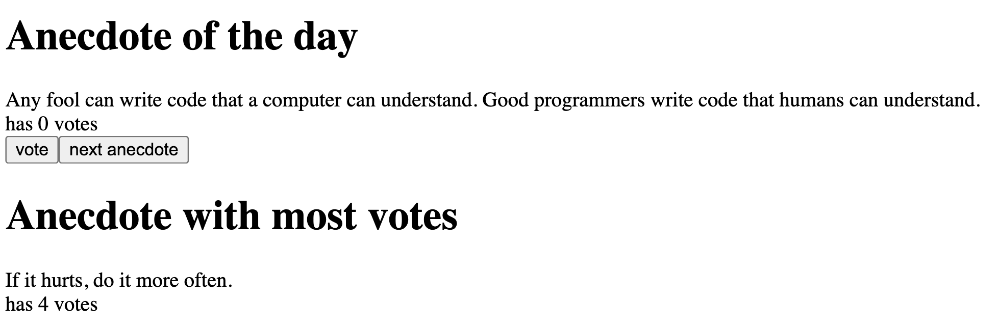

# Full Stack Open - Part 1: Anecdotes

This project is the **Anecdotes** application, developed as part of **Part 1: Introduction to React** in the [Full Stack Open](https://fullstackopen.com/en/) course by the University of Helsinki. It utilizes **Vite** as the development server and build tool, providing a fast and modern development environment for React.

## 🚀 Project Description

This project focuses on building a simple application that displays anecdotes and allows users to vote for their favorites. It introduces concepts of managing state within a React application, handling events to update state, and finding and displaying the entry with the highest value (the anecdote with the most votes).

## ✅ Features

- Displays a random anecdote.
- Allows users to vote for the currently displayed anecdote.
- Keeps track of the votes for each anecdote.
- Displays the anecdote with the highest number of votes.
- Conditionally renders the "Anecdote with most votes" section only after votes have been cast.

## 🛠 Prerequisites

- [Node.js](https://nodejs.org/) (v16 or newer)

## ⚙️ Getting Started

To run this project locally:

```bash
# Clone the repository
git clone https://github.com/devnischandra/fullstackopen.git
cd fullstackopen/part1/anecdotes

# Install dependencies
npm install

# Start the development server
npm run dev
```
## 🖼️ Preview



## 🙋‍♂️ Connect with Me

[](https://github.com/devnischandra)
[](https://www.linkedin.com/in/devnischandra)
