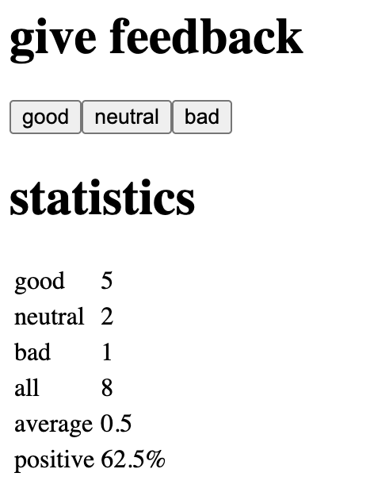

# Full Stack Open - Part 1: Unicafe

This project is the **Unicafe** application, developed as part of **Part 1: Introduction to React** in the [Full Stack Open](https://fullstackopen.com/en/) course by the University of Helsinki. It utilizes **Vite** as the development server and build tool, providing a fast and modern development environment for React.

## 🚀 Project Description

This project focuses on building a simple feedback application where users can provide feedback (good, neutral, bad) and view statistics based on the collected feedback. It serves as an introduction to handling component state, event handlers, and conditional rendering in React to display dynamic content and calculated statistics.

## ✅ Features

- Allows users to submit feedback (good, neutral, bad).
- Displays the count for each feedback category.
- Calculates and displays the total number of feedback entries.
- Calculates and displays the average score (often with good=1, neutral=0, bad=-1).
- Calculates and displays the percentage of positive feedback.
- Conditionally renders statistics only when feedback has been submitted.

## 🛠 Prerequisites

- [Node.js](https://nodejs.org/) (v16 or newer)

## ⚙️ Getting Started

To run this project locally:

```bash
# Clone the repository
git clone https://github.com/devnischandra/fullstackopen.git
cd fullstackopen/part1/unicafe

# Install dependencies
npm install

# Start the development server
npm run dev
```
## 🖼️ Preview



## 🙋‍♂️ Connect with Me

[](https://github.com/devnischandra)
[](https://www.linkedin.com/in/devnischandra)
